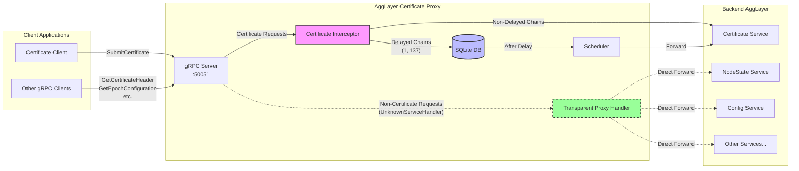

# AggLayer Certificate Proxy
A small proxy to provide the following functionality:
- Delay outgoing AggLayer certificates
- Provide statistics on outgoing AggLayer certificates
- Allow a kill-switch type functionality to prevent outbound bridging in case of network emergency

# How it works



## Quick Start

```bash
# Build and run the proxy
make run

# Run integration tests
make test-integration
```

## Configuration

The proxy accepts the following command-line flags:

- `-grpc`: gRPC server address (default: `:50051`)
- `-http`: HTTP server address (default: `:8080`)
- `-db`: SQLite database path (default: `certificates.db`)
- `-delayed-chains`: Comma-separated list of chain IDs to delay (default: `1,137`)
- `-delay`: Delay duration for certificate processing (e.g., `48h`, `30m`, `2h15m`) (default: `48h`)
- `-aggsender-addr`: Address of the backend agglayer to forward all requests to (optional)
- `-scheduler-interval`: How often to check for pending certificates (default: `30s`)
- `-kill-switch-api-key`: API key for kill switch endpoint (required)
- `-kill-restart-api-key`: API key for restart endpoint (required)
- `-data-key`: API key for certificate endpoints (required)
- `-certificate-override-key`: API key for overriding lockout of a certificate (will trigger sending in the next service iteration)
- `-supsicious-value`: High water mark for suspicious value certificates (sum of all bridge out tokens)"
- `-token-values`: csv in format [address]:[value] (without the leading 0x on the address) to represent a dollar value for a token (used for suspicious value calculation)

note: ommitting the suspicious-value or token-values flags will treat all certificates as suspcious if the have any bridge exits

## Kill Switch Functionality

The proxy includes a kill switch mechanism that allows stopping the certificate scheduler in case of emergencies. This prevents delayed certificates from being sent to the aggsender.

### How it works:

1. **Kill Switch Endpoint**: POST to `/kill?key=YOUR_KILL_SWITCH_API_KEY`
   - Requires 3 calls within 1 minute to activate
   - Once activated, the scheduler stops processing certificates
   - The status persists in the database even if the proxy restarts

2. **Restart Endpoint**: POST to `/restart?key=YOUR_RESTART_API_KEY`
   - Requires 3 calls within 1 minute to restart the scheduler
   - Once activated, the scheduler resumes processing certificates

### Example Usage:

```bash
# Start the proxy with API keys
./proxy \
    -kill-switch-api-key="your-secret-kill-key" \
    -kill-restart-api-key="your-secret-restart-key" \
    -data-key="your-secret-key"

# Activate kill switch (requires 3 calls in 1 minute)
curl -X POST "http://localhost:8080/kill?key=your-secret-kill-key"
curl -X POST "http://localhost:8080/kill?key=your-secret-kill-key"
curl -X POST "http://localhost:8080/kill?key=your-secret-kill-key"

# Restart scheduler (requires 3 calls in 1 minute)
curl -X POST "http://localhost:8080/restart?key=your-secret-restart-key"
curl -X POST "http://localhost:8080/restart?key=your-secret-restart-key"
curl -X POST "http://localhost:8080/restart?key=your-secret-restart-key"
```

The scheduler status is displayed on the main web interface at `http://localhost:8080/`

## Testing

Run the integration tests:

```bash
cd tests && make all
```

This runs automated tests for:
- **Kill switch**: Emergency stop functionality with 3-call activation
- **Passthrough**: Non-delayed certificates pass through immediately

See [tests/README.md](tests/README.md) for details.

## TODO
- add 2x new flags on startup to be stored in a new table 'credentials', they will be used to authenticate the APIs and should be passed on query string as ?key=
		- mgmt_api_key
		- stats_api_key
- add repo to aikido and security scan it
- add sensible logging for alerting purposes - tracking the total amount of bridging for each chainid
- deletion of certificates on send - delayed certs should be removed from the DB after send
